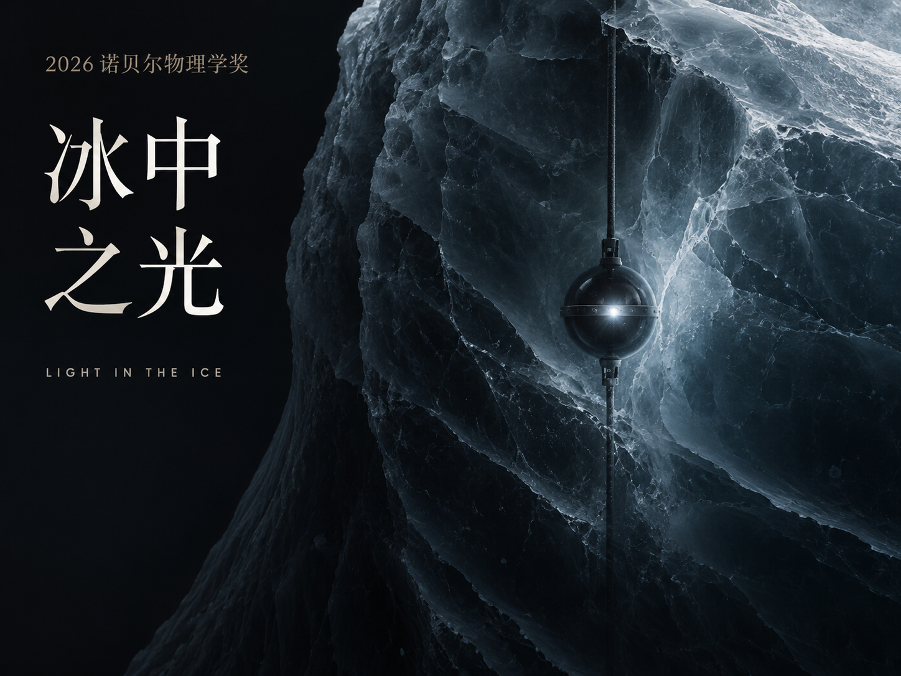

# 冰中之光 · Light in the Ice — 源代码

2026 年诺贝尔物理学奖（弗朗西斯·哈尔岑 / 冰立方中微子天文台）动画短片的全部源代码。
成片：1920×1080，24 fps，222 秒（5328 帧），H.264 + AAC。

画面和声音都是程序生成的，没有任何外部素材：

- **画面**：一个自写的 WebGL2 小引擎（HDR 叠加光点、带光晕的线条、程序化背景、泛光、胶片颗粒），加上 HTML/CSS 中文排版。
  每一帧都由时间 `t` 唯一确定，用无头 Chromium 逐帧截图后交给 ffmpeg 编码。
- **声音**：Python（numpy/scipy）从零合成的配乐与音效：pad、钟、拨弦、低频冲击、扫频噪声、冰裂声、混响等。
  所有音效的时间点都从画面时间线导出（`cues.json`），所以音画同步是由同一份时间线保证的。

## 文件

| 文件 | 作用 |
|---|---|
| `index.html` | 页面入口，排版样式（字体、字号、颜色） |
| `engine.js` | WebGL2 渲染引擎：光点/线条绘制、背景着色器（冰层、极光、雪原）、泛光、色调映射、颗粒 |
| `film_core.js` | 时间线文字系统、冰立方探测器几何（86 根缆线 / 5160 个模块）、切伦科夫光到达时间计算、星空与地球 |
| `film_scenes.js` | 前半段场景：开场、标题、幽灵粒子、三种信使、南极冰面、下潜、阵列、光学模块剖面 |
| `film_scenes2.js` | 后半段场景：切伦科夫光锥、径迹与簇射、大气 μ 子背景、否决层、2013/2014 发现、尾声 |
| `film_main.js` | `seek(t)`：按时间渲染某一帧；同时导出音效时间点 |
| `audio.py` | 配乐与音效合成，读 `cues.json`，输出 `score.wav` |
| `export_cues.js` | 从画面时间线导出 `cues.json` |
| `render.js` | 渲染一段：`node render.js <名字> <起始秒> <结束秒>` → `chunks/<名字>.mp4` |
| `render_all.sh` / `chunks.txt` | 按场景分 14 段渲染（可只重渲某几段：`./render_all.sh c08 c09`） |
| `assemble.sh` | 导出时间点 → 合成声音 → 响度标准化（-16 LUFS）→ 拼接视频 → 封装成 `final.mp4` |
| `tools/` | 调试工具：`snap.js` 截取任意时刻静帧，`sheet.py` 拼缩略图，`plot_audio.py` 画响度和频谱图 |

## 运行环境

- Node.js 18+，`npm install`（装 Playwright），然后 `npx playwright install chromium`
- Python 3，`pip install numpy scipy`（画图工具还需要 `matplotlib`、`pillow`）
- ffmpeg（需要 libx264）
- 字体：优先用 Noto Serif/Sans CJK SC 和 Inter。macOS 上没有时会自动退回宋体 / 苹方，版面会略有差异。

## 用法

```bash
npm install && npx playwright install chromium

# 预览某一时刻（输出到 snaps/）
node tools/snap.js snaps 21.5 121 196.5

# 渲染全部画面（2 核 CPU 约 45 分钟；只改了某场就只重渲那一段）
./render_all.sh

# 合成声音并封装成片
./assemble.sh          # → final.mp4
```

也可以直接用浏览器打开 `index.html`，在控制台执行 `seek(121)` 查看任意时刻的画面。

## 修改指引

- **文字**：在各场景的 `setup()` 里，`F.ui({ t0, t1, x, y, cls, html })` 就是一条字幕，`t0`/`t1` 是出现和消失的秒数。
- **时间结构**：每个场景的 `t0`/`t1`，加上 `chunks.txt` 的分段，两处要保持一致。
- **音乐**：`audio.py` 里的 `compose()` 是整部配乐的和弦与旋律表（按秒排布）；`sfx()` 定义每种音效的声音。
- **颗粒 / 泛光 / 暗角**：`film_main.js` 里的 `e.post`。
- 渲染时为保证结果稳定，使用了 Chromium 的软件 GL（`--use-angle=swiftshader`）。在有 GPU 的电脑上去掉 `render.js` 里的这几个参数会快很多。

## 数据来源

- 授奖词与评语：NobelPrize.org 2026 年物理学奖新闻稿（经多家媒体报道核对）
- IceCube Collaboration, *Science* 342, 1242856 (2013) — arXiv:1311.5238
- IceCube Collaboration, *Phys. Rev. Lett.* 113, 101101 (2014) — arXiv:1405.5303
- IceCube Collaboration, *JINST* 12, P03012 (2017) — arXiv:1612.05093
- IceCube 官方时间线、关于大气 μ 子通量的新闻稿

片中粒子路径与探测事件的光点分布为示意动画，数字均取自上述资料。

## B 站封面

当前封面为 4:3（1448×1086）的冰体微光版，保存在 `assets/cover-4x3.png`。封面单独生成，不属于程序渲染的影片画面。



GitHub 仓库包含源码、时间线数据和封面；成片与渲染中间文件保留在本地。
